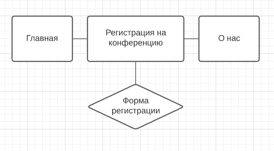
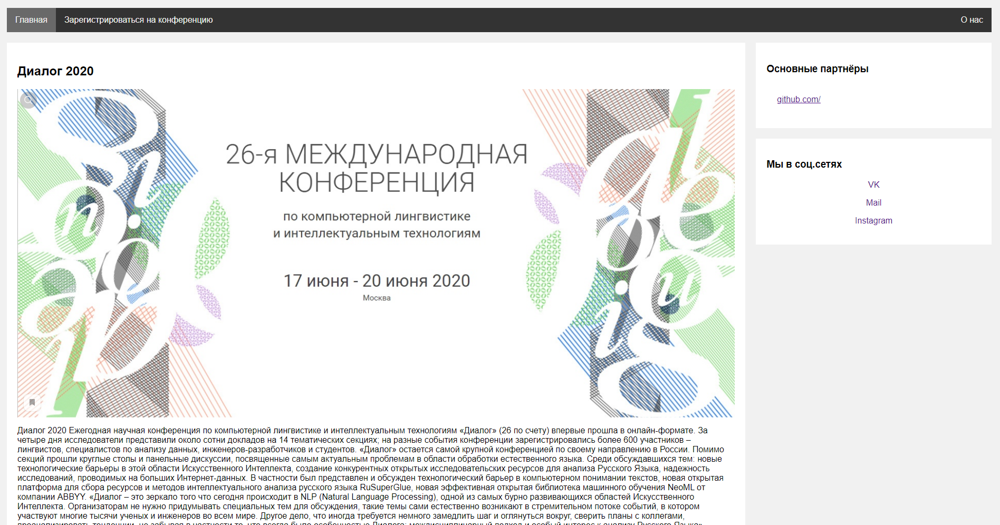
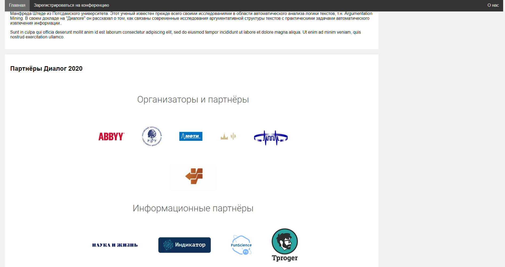
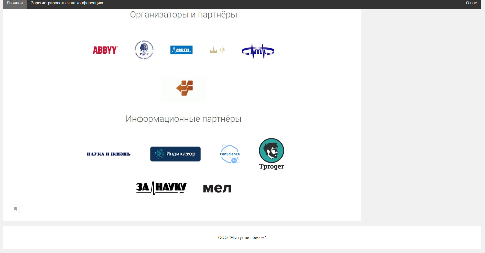
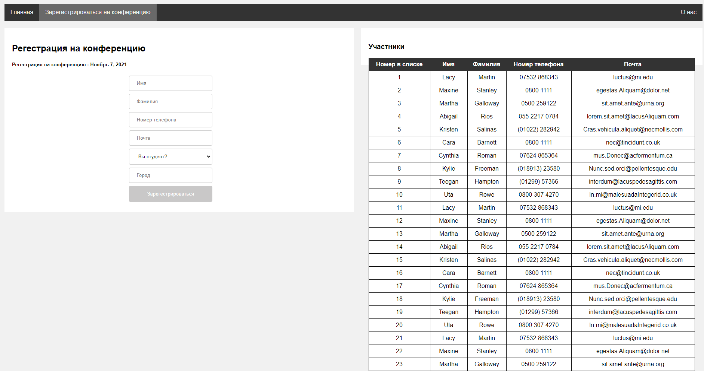
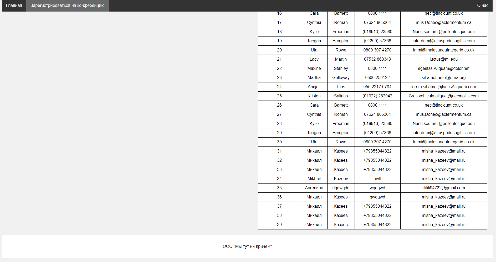
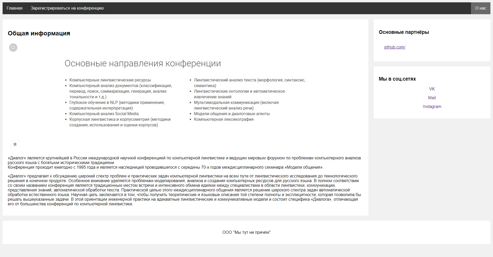
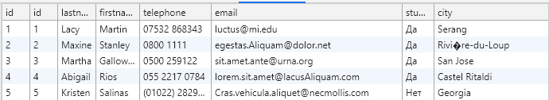
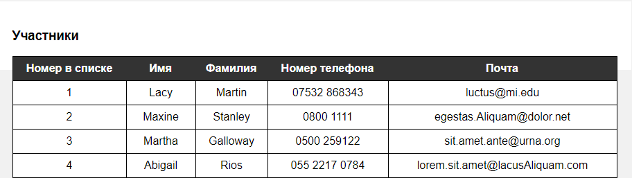

**Национальный исследовательский университет «МЭИ»**

**ИНЖЕНЕРНО-ЭКОНОМИЧЕСКИЙ ИНСТИТУТ**

\________________________________________________________\_

Кафедра Безопасности и информационных технологий

**Курсовая работа**

По дисциплине **«***Проектирование сетевых и мобильных приложений***»**

**Тема:** «Разработка многостраничного сайта для онлайн регистрации на
конференцию»

>   **ОГЛАВЛЕНИЕ**

[Введение	3](#_Toc59229206)

[1.	ПОСТАНОВКА ЗАДАЧИ	4](#_Toc59229207)

[2.	структура формы	5](#_Toc59229208)

[3.	Струкура сайта	6](#_Toc59229209)

>   [3.1.	Главная страница	6](#_Toc59229210)

>   [3.2.	Страница регистрации	6](#_Toc59229211)

>   [3.3.	Страницы “О нас”	7](#_Toc59229212)

[4.	ИНТЕРФЕЙС САЙТА	8](#_Toc59229213)

>   [4.1.	Стартовая главная страница	8](#_Toc59229214)

>   [4.2.	Страница «Зарегистрироваться на конференцию»	9](#_Toc59229215)

>   [4.3.	Страница «О нас»	10](#_Toc59229216)

[5.	ПОДКЛЮЧЕНИЕ БД	11](#_Toc59229217)

[заключение	12](#_Toc59229218)

# Введение

Была поставлена задача разработать форму для регистрации на офлайн конференцию,
создать несколько WEB-страниц, а также создать интерфейс для них.

Целью данного проекта является разработка сайта для компании

«ООО "Мы тут ни причём"” с последующим размещением в сети Интернет.

# ПОСТАНОВКА ЗАДАЧИ

Сайт должен предоставлять доступ к информации о мероприятии, об истории компании
организатора, ее новостям, иметь форму регистрации.

Сайт должен быть разработан на языке разметки HTML, с использованием стилей CSS,
а также с использованием JavaScript. После окончания работ необходимо обеспечить
возможность Заказчику самостоятельно вносить изменения (редактировать) в
структуру и содержимое сайта.

Для того, чтобы добиться поставленной задачи, необходимо:

-   создать структуры формы

-   разработать саму форму, а также предусмотреть всевозможные поля реализуемой
    формы, указать обязательные, предусмотреть правильность вводимых данных

-   создать структуру сайта

-   разработать интерфейс сайта

-   подключить сайт к бд websql

# структура формы

Форма для бронирования тура на отдых должна содержать следующие поля:

| **Название поля** | **Комментарий**                                   | **Особенности** |
|-------------------|---------------------------------------------------|-----------------|
| Имя               | Имя участника(обязательно)                        | type="text"     |
| Фамилия           | Фамилия участника(обязательно)                    | type=" text "   |
| Номер телефона    | Номер телефона участника(обязательно)             | type="tel"      |
| Почта             | Поле выбора календарной даты отлета (обязательно) | type="email"    |
| Обучающийся       | Позволяет выбрать является ли участник студентом  | Select:  Да Нет |
| Город             | Город проживания участника(обязательно)           | type=" text "   |

# Струкура сайта

Структурная схема сайта:

## Главная страница

Содержание страницы:

-   Шапка страницы

-   Список событий

-   Изображение

-   Заголовок

-   Описание

-   Список партнёров

-   Блок ссылок на соц. сети

-   Подвал страницы

## Страница регистрации

Содержание страницы:

-   Шапка страницы

-   Блок формы регистрации на конференцию

-   Список участников

-   Подвал страницы

## Страницы “О нас” 

Содержание страницы:

-   Шапка страницы

-   Общая информация

-   Изображение

-   Заголовок

-   Текст

-   Список партнёров

-   Блок ссылок на соц. Сети

-   Подвал страницы

# ИНТЕРФЕЙС САЙТА

## Стартовая главная страница

## Страница «Зарегистрироваться на конференцию»

## Страница «О нас»

# ПОДКЛЮЧЕНИЕ БД

Для данного сайта было необходимо использовать WebSql в качестве базы данных для
данных отправленных из формы.

Все действие по подключению и действиями с данными проводились в отдельном js
документе.

Создана база данных при использовании следующего метода:

var db = openDatabase('bd1', '1.0', 'Test DB', 2 \* 1024 \* 1024);

Также при создании базы данных сразу создается таблица:

CREATE TABLE IF NOT EXISTS conference (id INTEGER PRIMARY KEY autoincrement,
lastname TEXT, firstname TEXT, telephone TEXT, email TEXT, student TEXT, city
TEXT)

Передача данных из формы в базу данных осуществляется с помощью функции
insertData().

Вывод данных из базы данных в таблицу html осуществляется с помощью функции
dataView().

Удаление таблицы базы данных осуществляется с помощью функции DeleteTable()//
Вызывается из консоли разработчика

Таблица с данными из БД:

Таблица, которую видит пользователь:

# заключение

В результате выполнения курсовой работы был разработан проект сайта, содержащий
в себе форму для регистрации на конференцию, имеющий собственный интерфейс, а
также подключенную базу данных.

Всё, что было реализовано на сайте, было создано с помощью языка разметки HTML,
языка таблиц стилей CSS, языка сценариев JavaScript.

Весь интерфейс был разработан исключительно с помощью HTML и CSS.

В ходе создания сайта к нему была подключена база данных WebSQL. Подключение
происходило с помощью JavaScript.
